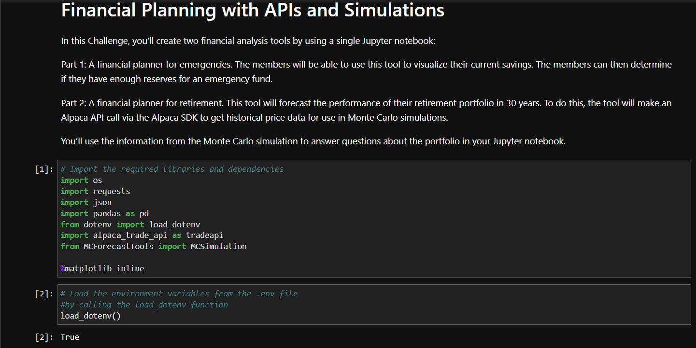
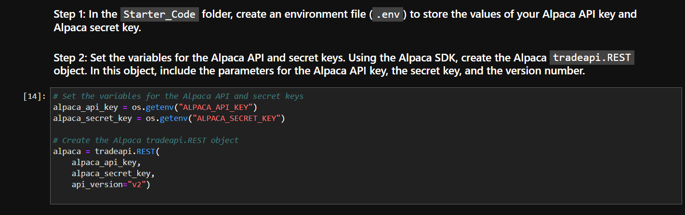
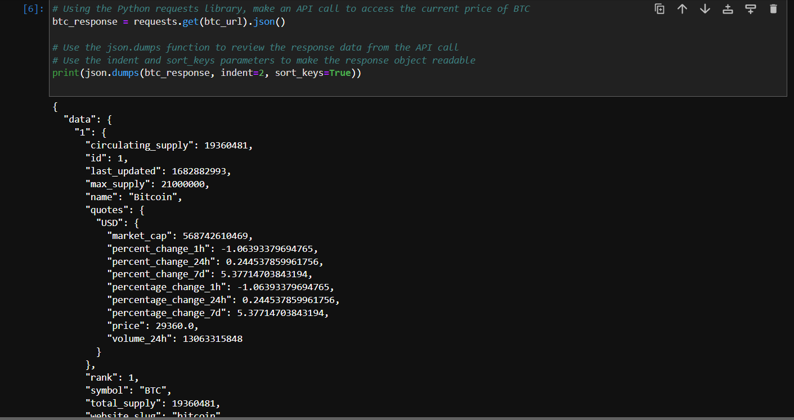
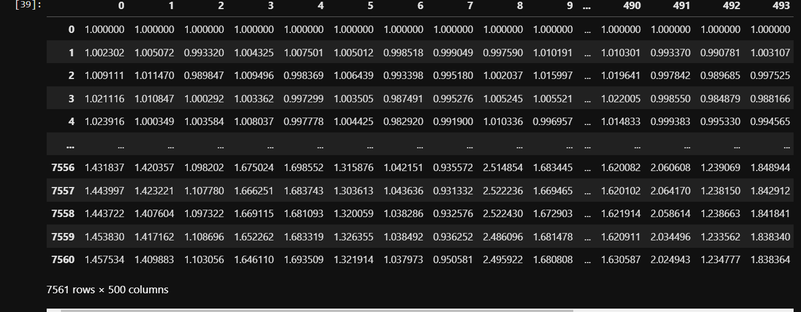
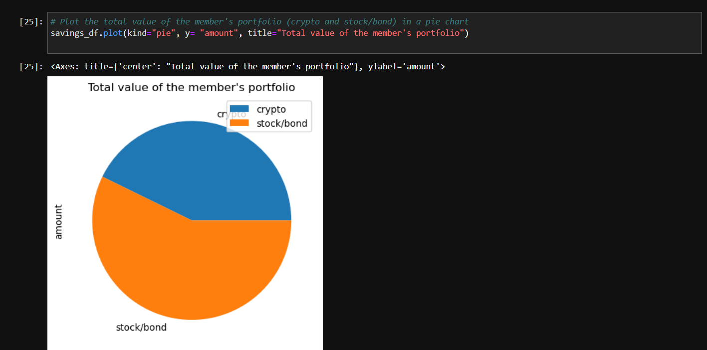
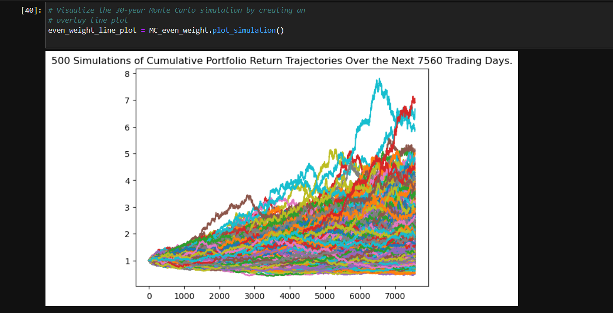
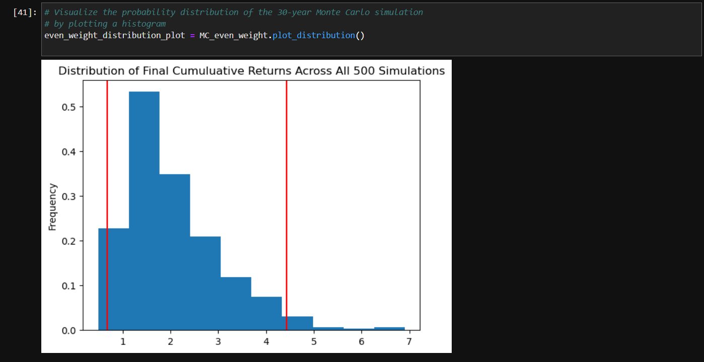

# Module_5_Challenge
# Finacial Planning Tools

Hello, this project is about the Financial planning tools. This tool is designed to help individuals manage their finances, create a financial plan, and achieve their financial goals. These tools may include spreadsheets, budgeting apps, investment calculators, retirement planning software, and tax planning tools. Using Pandas as main package to run and test sequences.

---

## Technologies

pandas is a software library written for the Python programming language for data manipulation and analysis. In particular, it offers data structures and operations for manipulating numerical tables and time series. Monte Carlo simulation can be used to estimate the risk and potential returns of a portfolio of investments, based on factors such as market volatility, interest rates, and economic conditions.

---

## Installation Guide

Import the correct packages to begin coding.

---

## Usage

Use Plots and data frame to get the correct portfolio

---

## Contributors

-Name: John Nguyen
-Email: nguyenjohn1337@gmail.com

---

## License

When you share a project on a repository, especially a public one, it's important to choose the right license to specify what others can and can't with your source code and files. Use this section to include the license you want to use.

Specify the details of your project’s license - that is, how others can or cannot use your code and files.
